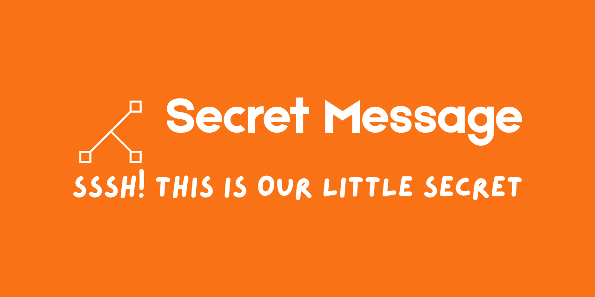

# Secret Message

**Secret Message** is a simple and "Ad-Ready" website that lets you send private messages that automatically disappear after being viewed.

🌐 Screenshot:

---

## What Can I Do Here?

You can:

* Write a short private message
* Create a secret link
* Share the link with someone
* Let the message delete itself automatically

No account. No login. No history.

---

## How It Works (Simple Steps)
1. Open the website
2. Type your message
3. Choose how many times it can be opened
4. Click **Create Message**
5. Copy the secret link
6. Send the link to someone

Once the message reaches its limit, it is **permanently deleted**.

---

## Example Use Cases

* Sharing a one-time password
* Sending a private note
* Temporary reminders
* Anonymous tips (non-harmful only)

---

## What Happens to My Message?

* It is stored **only temporarily**
* It deletes itself automatically
* It cannot be recovered after deletion
* Even the site owner cannot read it after expiration

---

## What This Site Is NOT

This site is **not**:

* A chat app
* A file storage service
* A secure vault for sensitive data
* A replacement for encrypted messaging apps

This project is intended for:

* Demonstration purposes
* Learning and experimentation
* Low-risk, temporary message sharing

Use it only for **low-risk, temporary messages**.

---

## Frequently Asked Questions (FAQ)

### ❓ Do I need an account?

No. Anyone can use the site without signing up.

### ❓ Can I see who opened my message?

No. The site does not track readers.

### ❓ Can I recover a deleted message?

No. Once it is gone, it is gone forever.

### ❓ Is this encrypted?

This is a simple demo project. Do not rely on it for high-security needs.

### ❓ Is it free?

Yes.

---

## Privacy Policy (Simple Version)

* No accounts are created
* No personal information is collected (Aside for your IP that we will only use to take down those who abuse the said services)
* Messages are temporary
* No long-term logs of message content

Your privacy is respected, but **absolute security is not guaranteed**.

---

## Terms of Use (Simple Version)

By using this site, you agree that:

* You will not post illegal, harmful, or abusive content
* Messages may be deleted automatically at any time
* The service is provided **as-is**
* The owner is not responsible for lost messages or misuse

---

## Disclaimer

This project is for **personal and demonstration purposes only**.
Do not use it for sensitive, legal, or critical communication.

---

## Created By

**STICKnoLOGIC**
Part of the sticknologic.is-a.dev projects

---

## Usage & Brand Restrictions

Although the source code of this project is publicly visible for transparency and learning purposes, the following restrictions apply:

* This project may not be used for commercial purposes
* You may not run a public or competing service based on this code
* You may not reuse the project name, branding, or domain
* This includes: Secret Message, STICKnoLOGIC, and sticknologic.is-a.dev
* Forks and modifications must give clear credit to the original author
* Private, personal, or internal use for learning is allowed

If you wish to use this project beyond these limits, explicit permission from the author is required.

---

## Want Improvements?

If you plan to expand this project, good next steps could be:

* Add a countdown timer
* Add optional password protection
* Add automatic time-based expiration
* Add a short “message viewed” notice

---

## License

The source code is licensed under the Apache License 2.0.
This provides:

* Strong “as-is” and no-liability protection
* Permission to view, study, and audit the code
* Explicit protection for project names and branding
* See the [LICENSE](./LICENSE) file for full legal text.